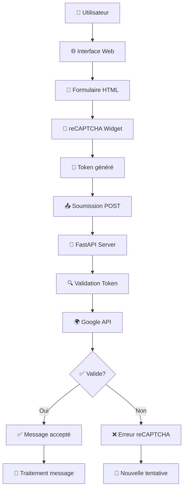

## reCAPTCHA v2 avec FastAPI — Démo sécurisée de formulaire

### 🧭 À propos

Ce projet est une petite application FastAPI qui illustre comment protéger un formulaire de contact avec Google reCAPTCHA v2 côté client et une validation côté serveur. Le serveur rend une page HTML via Jinja2, sert les fichiers statiques et expose un endpoint POST qui vérifie le token reCAPTCHA auprès de l'API de Google avant de traiter le message.

### ✨ Fonctionnalités

- **FastAPI + Jinja2**: rendu serveur de `templates/index.html` et assets dans `static/`
- **reCAPTCHA v2**: intégration du widget côté client et validation serveur via Google
- **Endpoints clairs**: `GET /`, `POST /verify`, `GET /health`
- **Clés de test**: valeurs par défaut fournies (clés de démonstration officielles de Google)

---

### 🏗️ Architecture

#### 📊 Diagramme de flux



#### 🔄 Flux de données

```
┌─────────────┐    ┌─────────────┐    ┌──────────────┐
│   CLIENT    │    │   SERVEUR   │    │    GOOGLE    │
│             │    │             │    │              │
│ 1. Charge   │───▶│             │    │              │
│    la page  │    │ 2. Renvoie  │    │              │
│             │◀───│  HTML +     │    │              │
│             │    │  site_key   │    │              │
│ 3. Utilisateur remplit le formulaire           │
│ 4. reCAPTCHA génère un token                   │
│ 5. POST /verify avec token  ─────────────────▶ │
│             │    │ 6. Vérifie token  ───────────▶ │
│             │    │             │    │ 7. Réponse  │
│             │    │◀────────────┘    │   validation│
│ 8. Résultat │◀───│ 9. Réponse JSON  │              │
└─────────────┘    └─────────────┘    └──────────────┘
```

---

### 📂 Structure du projet

```
certificats_https/
├─ server/
│  └─ main.py              # App FastAPI, routes, validation reCAPTCHA
├─ templates/
│  └─ index.html           # Formulaire avec widget reCAPTCHA
├─ static/
│  └─ style.css            # Styles basiques du formulaire
└─ requirements.txt        # Dépendances Python
```

---

### ⚙️ Prérequis

- Python 3.10+
- Accès réseau sortant vers l'API Google reCAPTCHA

### 📦 Installation

```bash
python -m venv .venv
.venv\Scripts\activate   # PowerShell/cmd sous Windows
pip install -r requirements.txt
```

### 🔐 Configuration (variables d'environnement)

Vous pouvez créer un fichier `.env` à la racine avec les variables suivantes. Des valeurs de démonstration sont déjà intégrées dans le code pour faciliter les tests en local.

```env
# Clé site côté client (démo officielle Google)
RECAPTCHA_SITEKEY=6LeIxAcTAAAAAJcZVRqyHh71UMIEGNQ_MXjiZKhI

# Secret côté serveur (démo officielle Google)
RECAPTCHA_SECRET=6LeIxAcTAAAAAGG-vFI1TnRWxMZNFuojJ4WifJWe

# URL de vérification côté Google (par défaut)
GOOGLE_VERIFY_URL=https://www.google.com/recaptcha/api/siteverify
```

Pour un environnement de production, remplacez les clés de démo par vos propres clés reCAPTCHA v2.

### ▶️ Lancer l'application

```bash
python -m server.main
# ou avec uvicorn
uvicorn server.main:app --host 127.0.0.1 --port 8000 --reload
```

Ouvrez ensuite `http://127.0.0.1:8000/` dans votre navigateur.

---

### 🚏 Endpoints

- `GET /` : rend la page du formulaire avec le widget reCAPTCHA et la `site_key`.
- `POST /verify` : valide le token reCAPTCHA auprès de Google et retourne un JSON.
- `GET /health` : vérification de santé simple `{"status": "ok"}`.

Exemple de réponse en cas de succès de `/verify`:

```json
{
  "ok": true,
  "message": "Formulaire validé",
  "email": "utilisateur@example.com"
}
```

Exemple en cas d'échec reCAPTCHA:

```json
{
  "ok": false,
  "error": "Échec reCAPTCHA",
  "details": ["invalid-input-response"]
}
```

---

### 🧪 Test rapide

1. Démarrez le serveur.
2. Ouvrez la page d'accueil, remplissez le formulaire.
3. Soumettez — les clés de démo permettent de valider le flux sans configuration.

Note: Les clés de démo Google sont destinées au développement/test et ne doivent pas être utilisées en production.

---

### 🔒 Bonnes pratiques (production)

- Utilisez vos propres clés reCAPTCHA v2 (site/secret) liées à votre domaine.
- Servez l'app derrière HTTPS (certificat valide) et un reverse proxy (Nginx, Caddy, Traefik).
- Limitez `CORS` aux origines légitimes (au lieu de `*`).
- Gérez les timeouts et la journalisation des erreurs côté serveur.

---

### 🛠️ Dépannage

- « reCAPTCHA manquant »: vérifier que le widget se charge et que la `site_key` est injectée.
- « Échec reCAPTCHA »: inspecter `details` renvoyés par Google pour le motif précis.
- Problèmes réseau: s'assurer que la machine peut joindre `google.com` sur HTTPS.

---

### 📄 Licence

Libre d'utilisation à des fins d'apprentissage et de démonstration. Ajoutez votre licence si nécessaire (MIT, Apache-2.0, etc.).


